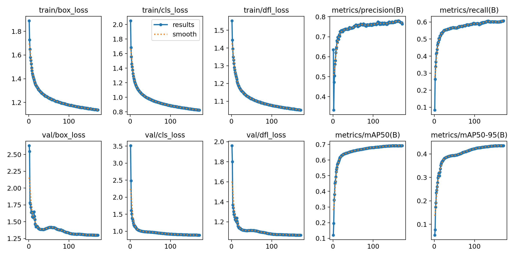
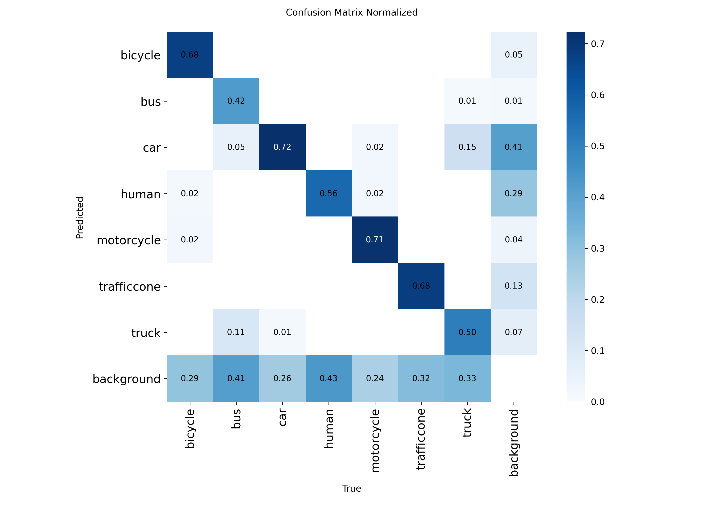
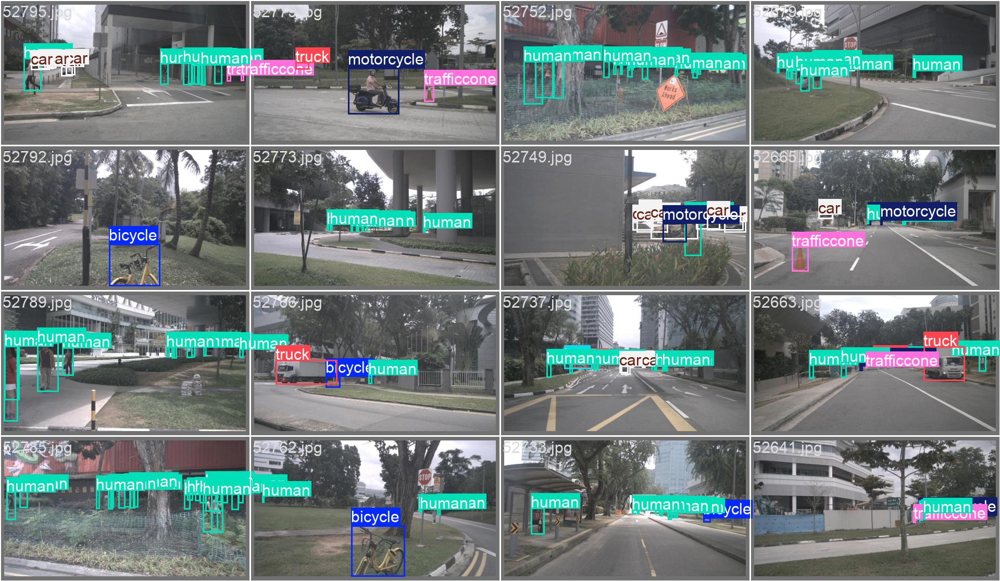
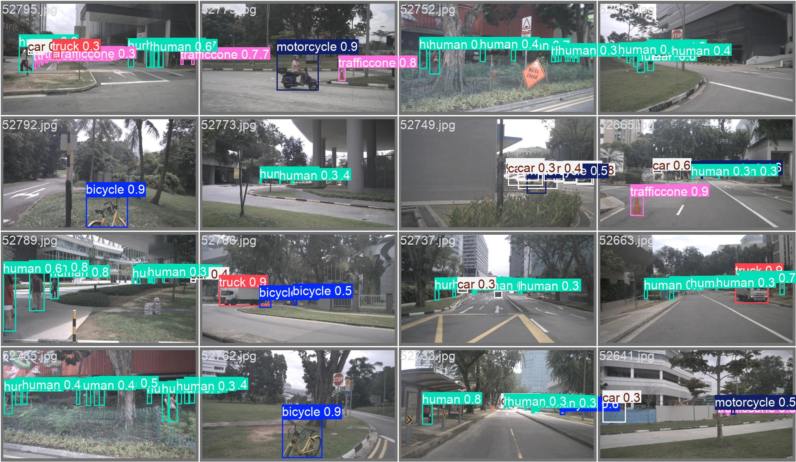

# 2D Object Detection for Autonomous Driving

This project implements a complete pipeline for 2D object detection in autonomous driving environments. It uses YOLO11 with PyTorch for training and inference, while integrating TensorBoard and MLflow for experiment tracking, and FiftyOne for dataset visualization and model evaluation.

---

## Features

- Train YOLO11 models with configurable hyperparameters.
- Real-time object detection and tracking on images and video streams.
- Automatic experiment logging and visualization with TensorBoard.
- Experiment comparison and results management with MLflow.
- Interactive dataset exploration and error analysis using FiftyOne.
- Modular codebase to extend for research or production use cases.
- Published fine-tuning run: **mAP50 0.69 / mAP50-95 0.44** on nuImages (see [Results](#results)).

---

## Installation

1. Clone this repository:

```bash
git clone https://github.com/Vicen-te/2D-object-detection-autonomous-driving.git

cd 2D-object-detection-autonomous-driving
```

2. Create a virtual environment (recommended):

```bash
python -m venv .venv
.venv\Scripts\activate # Windows
source .venv/bin/activate # Linux/macOS
```

3. Install required packages:

```bash
pip install -r requirements.txt
```

4. Required libraries:

- `ultralytics` – YOLO11 models and training utilities.
- `torch` – Deep learning framework.
- `tensorboard` – Training visualization.
- `mlflow` – Experiment tracking and management.
- `fiftyone` – Dataset inspection and model evaluation.

---

## Dataset

For training and evaluation, this project uses the **nuImages** dataset provided by Roboflow. The dataset was downloaded in **COCO format** and is specifically designed for autonomous driving, containing annotated images suitable for 2D object detection tasks.

- **Source:** [nuImages on Roboflow](https://universe.roboflow.com/new-workspace-2yqcq/nuimages-ijmym/dataset/1)  
- **Original Dataset Terms:** [nuScenes Terms of Use](https://www.nuscenes.org/terms-of-use)  
- **License:** [CC BY 4.0](https://creativecommons.org/licenses/by/4.0/)  

### Splits

Only the train split of the original dataset was used.
This split was further divided into three subsets — train, validation, and test — so that all experiments are performed using data derived from the same source.

Additionally, you can compare your results against the original validation split provided by Roboflow to evaluate consistency with the official dataset partition.


### Structure

Inside the dataset directory, you need to create two main subdirectories:

```bash
dataset/
├── images/
│   └── unprocessed/
├── labels/
```

- images/unprocessed/ → Place all your raw images here.
  - (Optional) You can keep both the original dataset and a renamed version with a cleaner naming convention.
  - If not, the script will automatically move the renamed images to their respective split directories (train, val, test).
  - The temporary renamed directory will be deleted after the split.
- labels/ → Place your coco.json annotation file here.

There is also an optional revert function available if you want to undo the split and restore the original dataset structure.

---

## Project Structure
```bash
2D-object-detection-autonomous-driving/
│
├─ scripts/                       # Core scripts for preprocessing, training, and evaluation
│ ├─ data/
│ │ ├─ augmentation_yolo.py       # Data augmentation for YOLO
│ │ ├─ coco_converter.py          # Convert COCO datasets to YOLO format
│ │ ├─ dataset_splitter.py        # Split dataset into train/val/test
│ │ └─ file_system_manager.py     # Handle dataset and file operations
│ │
│ ├─ model/
│ │ ├─ clustering_analyzer.py     # Optional clustering analysis of features
│ │ └─ yolo_manager.py            # YOLO training, inference, and tracking manager
│ │
│ ├─ utils/
│ │ ├─ config_logging.py          # Logging configuration
│ │ ├─ project_config.py          # Centralized paths and configurations
│ │ ├─ temperature_monitor.py     # Optional CPU/GPU temperature monitor
│ │ └─ types_aliases.py           # Type hints and custom aliases
│ │
│ ├─ visualization/
│ │ ├─ fiftyone_cli_visualizer.py # Dataset visualization with FiftyOne (CLI)
│ │ ├─ fiftyone_visualizer.py     # Dataset visualization with FiftyOne (GUI)
│ │ └─ metrics_visualizer.py      # Plot YOLO training/validation metrics from CSV
│ │
│ ├─ data_processor.py            # Handles preprocessing pipeline
│ ├─ main.py                      # Orchestrates the full pipeline
│ └─ model_manager.py             # Manages models: training and post-training analysis
│
├─ yamls/                         # Model configuration files
│ ├─ *.yaml                       # Hyperparameters, training setups, optimizer settings
│ └─ yolo11n_example.yaml         # YOLO model architecture and config
│
├─ videos/                        # Videos for prediction and tracking
│ └─ *.mp4
│
├─ training_results/              # Model outputs and training results
│ ├─ *.pt                         # Model weights after training
│ └─ results.csv                  # Training metrics, including final epoch information
```

---

## Usage

1. Train a model
```bash
python scripts/main.py
```

2. Monitor with TensorBoard
```bash
tensorboard --logdir training_results/
```

3. Launch MLflow UI
```bash
mlflow ui --backend-store-uri mlflow/
```

4. Explore dataset and results with FiftyOne — You can launch the custom CLI visualizer to explore YOLO/COCO datasets:
```bash
python scripts/visualization/fiftyone_cli_visualizer.py \
  --p <path_to_dataset_root> \    # Path to the dataset root directory
  --f <yolo_or_coco> \            # Dataset format: yolo or coco
  --s <train_val_or_test> \       # Dataset split: train, val, or test (optional, default: val)
  --n <path_to_names_json>        # Path to the original names JSON (optional)
```

---

## Results

Fine-tuning run of **YOLO11n** (COCO-pretrained) on the nuImages 7-class dataset.
All numbers come from [`training_results/finetuning/results.csv`](training_results/finetuning/results.csv);
the exact configuration is in [`args.yaml`](training_results/finetuning/args.yaml).

**Setup:** AdamW, `lr0=1e-3`, `weight_decay=0.01`, `imgsz=960`, `batch=32`, AMP on, mosaic off,
5 warm-up epochs, early stopping with `patience=10`. Training stopped at epoch 172 of a 1000-epoch
budget (~21 h on a single GPU). Best checkpoint by mAP50-95 is epoch 162.

| Checkpoint | Precision | Recall | mAP50 | mAP50-95 |
|---|---:|---:|---:|---:|
| epoch 1 | 0.635 | 0.083 | 0.121 | 0.054 |
| epoch 50 | 0.747 | 0.566 | 0.658 | 0.394 |
| epoch 100 | 0.763 | 0.590 | 0.680 | 0.422 |
| **epoch 162 (best)** | **0.779** | **0.602** | **0.691** | **0.435** |
| epoch 172 (last) | 0.764 | 0.608 | 0.691 | 0.435 |

<p align="center">
  
</p>

### What the confusion matrix says

<p align="center">
  
</p>

- **The gap between precision (0.78) and recall (0.60) is misses, not mislabels.** The
  `background` row shows that 24–43% of each class is never detected at all: humans (43%),
  buses (41%), trucks (33%), traffic cones (32%). Once an object *is* detected, the class is
  mostly right (car 0.72, motorcycle 0.71, bicycle 0.68, traffic cone 0.68).
- **Large-vehicle confusion.** 11% of buses are predicted as trucks and 15% of trucks as cars.
  These are the two classes with the fewest training instances, and they share silhouettes at
  the resolutions where they appear.
- **Human is the hardest class** (0.56 recall on detected instances, 43% missed): pedestrians
  are small relative to the 960 px frame and a nano backbone has limited capacity for them.

Sample validation batch (ground truth vs. predictions):

<p align="center">
  
  
</p>

### The three regimes, compared at an equal budget

The full-length run above is fine-tuning only. To actually compare the three regimes the pipeline
ships, all three were trained under an **identical budget** — 30 epochs, 25% of the non-augmented
train split, batch 16, no early stopping (`scripts/regime_comparison.py`, results in
[`training_results/regime_comparison/`](training_results/regime_comparison/)):

| Regime | Precision | Recall | mAP50 | mAP50-95 | GPU time |
|---|---:|---:|---:|---:|---:|
| SGD from scratch | 0.480 | 0.333 | 0.343 | 0.174 | 52 min |
| **AdamW transfer learning** (first 10 layers frozen) | **0.681** | **0.474** | **0.545** | **0.333** | 41 min |
| AdamW fine-tuning (all layers) | 0.635 | 0.454 | 0.511 | 0.291 | 52 min |

Two things worth reading out of this table:

- **COCO pretraining is worth more than the entire budget.** From scratch after 30 epochs (0.174)
  is not close to either pretrained regime; its best epoch was 20 and it had stopped improving.
- **Under a short budget, freezing beats unfreezing.** Transfer learning converges faster because
  the frozen backbone cannot be disturbed; full fine-tuning spends its early epochs perturbing
  pretrained weights and needs longer to recover — which the long run confirms: given 172 epochs,
  fine-tuning reaches mAP50-95 **0.435**, well past transfer learning's short-budget 0.333. Freeze
  for fast turnaround, unfreeze when you can afford the schedule.

Numbers are not comparable with the headline table above (different split, fraction, batch and
epochs); the comparison is only internal to this table, which is the point of an equal budget.

### Honest scope

- The headline table is the only full-length run; the regime comparison above is deliberately
  short-budget. A full-length run of the other two regimes remains open work.
- `YOLO11n` was chosen for training-time budget, not accuracy. The obvious next steps are a larger
  backbone (`s`/`m`) and class-balanced sampling for `bus`, `truck` and `human`.
- Model weights are not committed; reproduce with the config above and `scripts/main.py`.

---

## Notes

- The system supports custom datasets with configurable number of classes.
- Training results are automatically logged into both TensorBoard and MLflow.
- Experiment reproducibility is ensured through configuration YAML files.
- Models can be switched easily between YOLO11n, YOLO11s, YOLO11m, YOLO11l, YOLO11x scales.

---

## License

MIT License © 2025 Vicente Brisa Saez  
GitHub: [https://github.com/Vicen-te](https://github.com/Vicen-te)